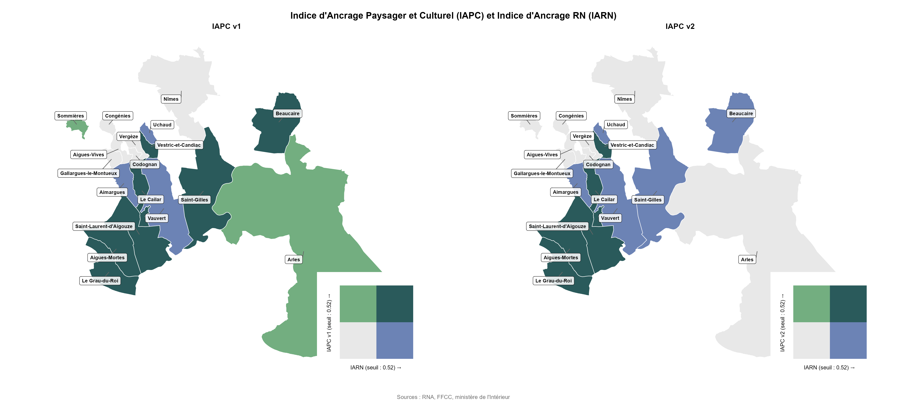
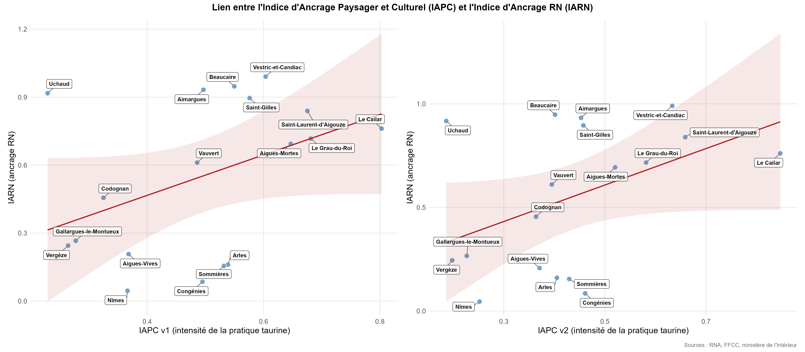

# Analyse territoriale — Petite Camargue

Diagnostic territorial exploratoire de 18 communes du Gard et des Bouches-du-Rhône situées autour de la Petite Camargue (dont Nîmes et Arles). L'analyse croise l'ancrage des traditions taurines et les comportements électoraux entre 2002 et 2024. La base communale comprend également des indicateurs socio-économiques (démographie, revenus, emploi, logement), préparés pour des analyses ultérieures.

Analyses quantitatives exploratoires réalisées par Lisa Willems en appui d'un travail de Marion Léger, géographe.

## Données

Toutes les sources sont publiques, à l'échelle communale. Elles ne sont pas versionnées (volume) : les placer dans `data/raw/` selon l'arborescence attendue par `script.R`.

| Thème | Source |
|---|---|
| Population, ménages, logement, diplômes, emploi | Insee, recensement de la population 2022 (bases communales) |
| Revenus et pauvreté | Insee, Filosofi 2020 ; indicateurs de précarité |
| Typologies territoriales, parcs naturels régionaux | Observatoire des territoires (ANCT) |
| Résultats électoraux | Ministère de l'Intérieur (data.gouv.fr) : présidentielles 2002 et 2022, législatives 2017 et 2024, municipales 2020 et 2026 |
| Associations | Répertoire national des associations (RNA), Gard et Bouches-du-Rhône ; Union des Clubs Taurins de France |
| Équipements sportifs (arènes) | Recensement des équipements sportifs (Data ES) |
| Manades, fêtes votives, abrivados, courses | Collecte manuelle par diverses associations |
| Référentiel et fond de carte | Insee, code officiel géographique 2025 ; contours des communes © les contributeurs d'OpenStreetMap, licence ODbL |

## Méthode

1. **Préparation** : chargement et filtrage des bases sur les communes étudiées, harmonisation des codes communes, passage des fichiers électoraux au format long (une ligne par commune et par candidat), repérage des associations taurines dans le RNA par mots-clés.
2. **Appariement** : constitution d'une base communale unique à partir des différentes sources.
3. **Indicateurs** (variables normalisées min-max, rapportées à la population pour les comptages) :
   - **IAPC — Indice d'Ancrage Paysager et Culturel** : intensité de la culture taurine. Deux versions sont comparées :
     - v1 : moyenne de trois dimensions (institutionnelle, pratique, patrimoniale) ;
     - v2 : moyenne de quatre dimensions (productive, associative, événementielle, patrimoniale).
   - **IARN — Indice d'Ancrage RN** : moyenne du niveau du vote RN (normalisé) et de sa constance (part des scrutins où la commune dépasse la médiane) sur 2002, 2017, 2022 et 2024.
4. **Analyse exploratoire, sans visée causale** : cartes bivariées, nuages de points et corrélations entre l'IAPC, le vote RN et l'IARN.

## Structure

```
analyse_camargue/
├── script.R            # préparation, appariement, indicateurs, graphiques
├── data/
│   ├── raw/            # données sources (non versionnées)
│   └── processed/      # base finale (non versionnée)
└── output/             # cartes et graphiques
```

## Reproduire

Ouvrir `analyse_camargue.Rproj` dans RStudio (les chemins sont relatifs à la racine du projet), puis exécuter `script.R`.

Packages : `readr`, `dplyr`, `tidyr`, `tibble`, `purrr`, `forcats`, `ggplot2`, `readxl`, `janitor`, `sf`, `biscale`, `cowplot`, `patchwork`, `ggrepel`, `writexl`, `DT`.

## Aperçu





## Limites

- **Petit échantillon** : l'analyse porte sur 18 communes. Les corrélations sont donc fragiles, sensibles à quelques communes atypiques, et leur significativité statistique est limitée.
- **Analyse descriptive, pas causale** : les liens observés entre l'IAPC et le vote RN peuvent refléter des facteurs communs (ruralité, structure par âge, revenus) plutôt qu'un effet des traditions taurines elles-mêmes.
- **Niveau communal** : les résultats décrivent des communes, pas des individus. On ne peut pas en déduire le comportement électoral des personnes attachées à ces traditions (risque d'erreur écologique).
- **Construction des indices** : les pondérations des dimensions de l'IAPC et de l'IARN reposent sur des choix raisonnés mais arbitraires. La normalisation min-max dépend des communes retenues, ce qui rend les scores relatifs à l'échantillon. La comparaison des deux versions de l'IAPC permet en partie de tester la sensibilité des résultats à ces choix.
- **Hétérogénéité des communes** : Nîmes et Arles sont bien plus peuplées que les autres communes. Les indicateurs rapportés à la population atténuent cet écart sans le faire disparaître.
- **Mesure de la culture taurine** : les associations taurines sont repérées dans le RNA par mots-clés, ce qui peut laisser passer des faux positifs (filtrés manuellement) comme des oublis. Certaines bases sont appariées par nom de commune plutôt que par code, ce qui est plus fragile.
- **Comparabilité des scrutins** : les années mêlent présidentielles et législatives, dont la participation et l'offre politique diffèrent.
